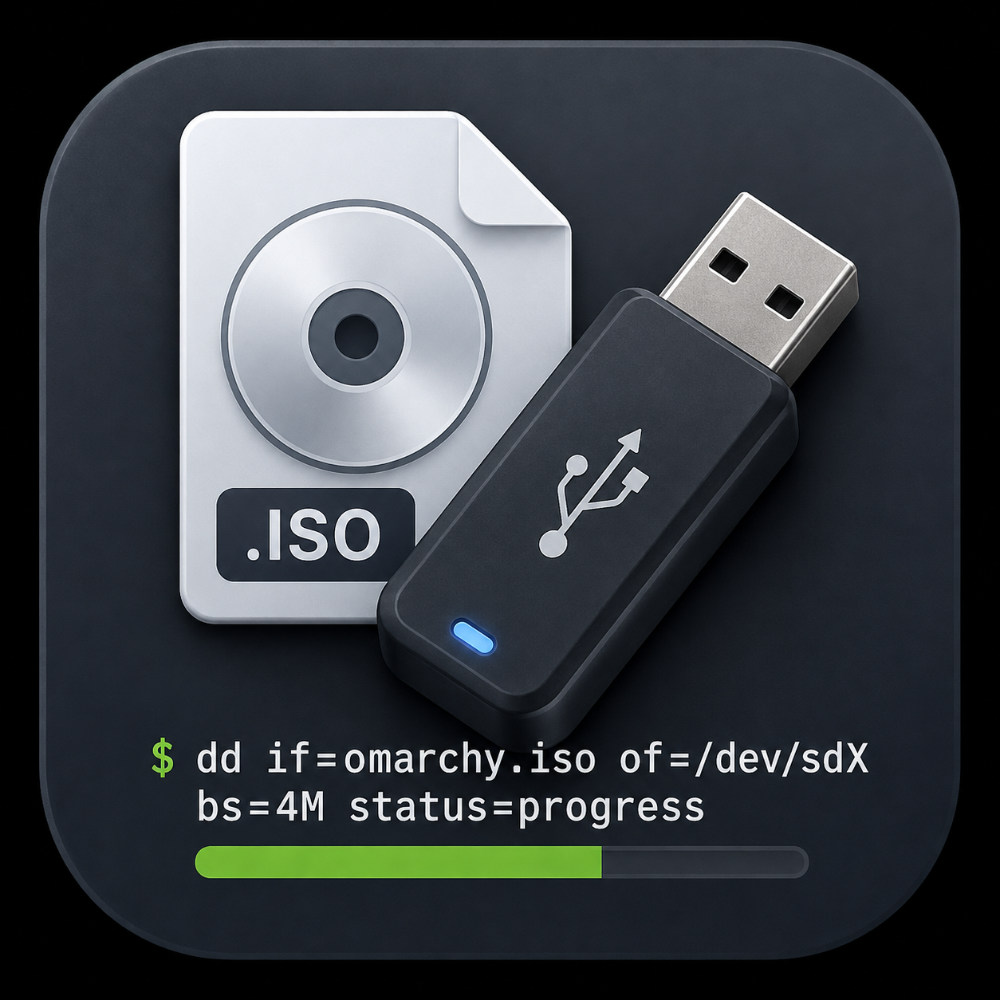
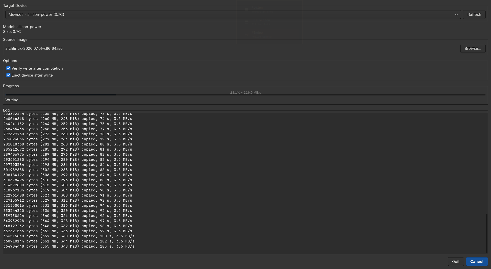

<p align="center">
  
</p>

<h1 align="center">DDWriter</h1>

<p align="center">
  A lightweight, GTK-based utility for writing ISO images to USB drives using <code>dd</code>
</p>

<p align="center">
  
  
  
  
</p>

---

## Features

- **Simple Interface** — Clean GTK3 GUI with intuitive controls
- **USB Device Detection** — Automatically detects and lists removable USB drives
- **Real-time Progress** — Live progress bar with speed indicator
- **Write Verification** — Optional SHA256 checksum verification after write
- **Auto Eject** — Automatically eject device when complete
- **Lightweight** — Single-file application, no bloat

## Screenshot

<p align="center">
  
</p>

## Requirements

- Linux (tested on Arch, Ubuntu, Fedora)
- Python 3.8+
- GTK3
- PyGObject (`python-gobject` / `python3-gi`)
- `lsblk` (util-linux)
- `udisks2` (optional, for auto-eject)

## Installation

### Automatic

```bash
git clone https://github.com/nightdevil00/DDWriter.git && cd DDWriter && ./install.sh
```

### Manual

```bash
git clone https://github.com/nightdevil00/DDWriter.git
cd DDWriter
# Copy files to desired location
sudo cp ddwriter.py ddwriter.png /opt/ddwriter/
```

### Dependencies

**Debian/Ubuntu:**
```bash
sudo apt install python3-gi gir1.2-gtk-3.0 udisks2
```

**Arch Linux:**
```bash
sudo pacman -S python-gobject gtk3 udisks2
```

**Fedora:**
```bash
sudo dnf install python3-gobject gtk3 udisks2
```

## Usage

```bash
python3 ddwriter.py
```

1. Select your USB device from the dropdown
2. Click **Browse** to select an ISO image
3. (Optional) Enable **Verify write** and **Eject device** options
4. Click **Write**
5. Enter your password when prompted
6. Wait for completion

## Uninstall

```bash
./uninstall.sh
```

## How It Works

DDWriter uses `dd` under the hood with `status=progress` for real-time feedback. The application:

1. Scans `/sys/block/` for removable block devices
2. Presents a filtered list of USB drives only
3. Executes `sudo dd if=<iso> of=<device> bs=4M status=progress oflag=sync`
4. Parses stdout to update the progress bar
5. Optionally verifies the write via SHA256 checksums

## Contributing

Contributions are welcome! Please feel free to submit a Pull Request.

1. Fork the repository
2. Create your feature branch (`git checkout -b feature/amazing-feature`)
3. Commit your changes (`git commit -m 'Add amazing feature'`)
4. Push to the branch (`git push origin feature/amazing-feature`)
5. Open a Pull Request

## License

This project is licensed under the MIT License - see the [LICENSE](LICENSE) file for details.

## Acknowledgments

- Inspired by [Rufus](https://rufus.ie) for Windows
- Built with GTK3 and Python
